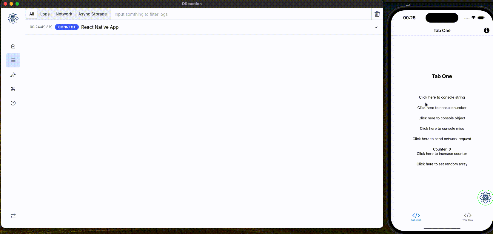
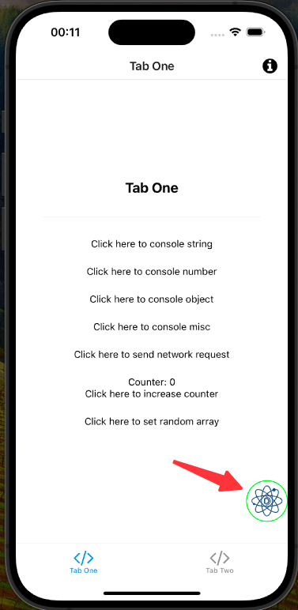
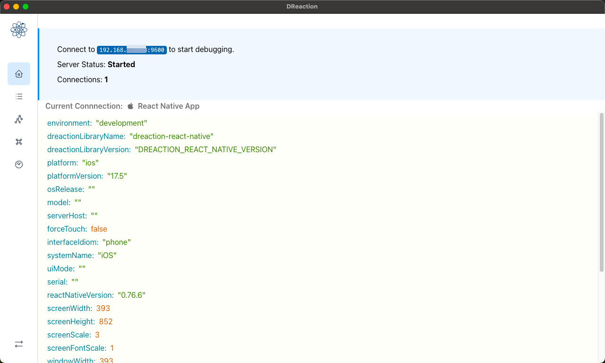
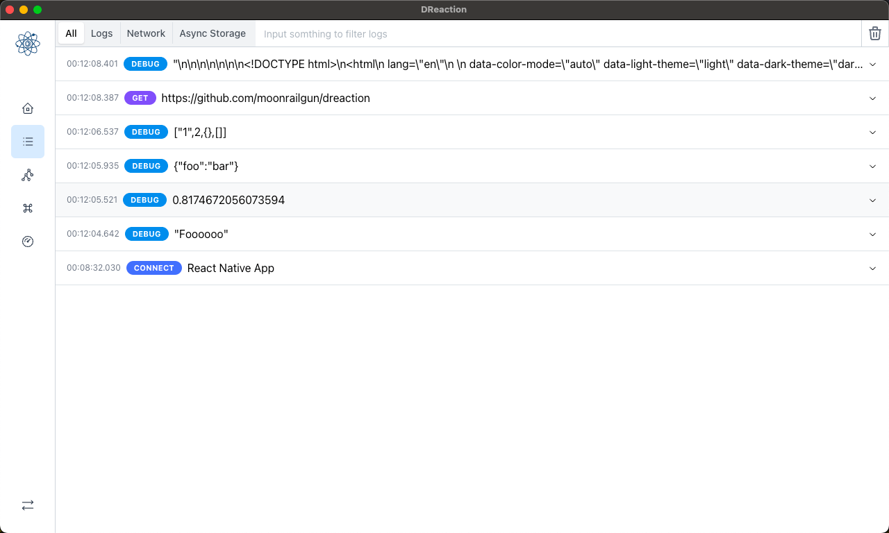
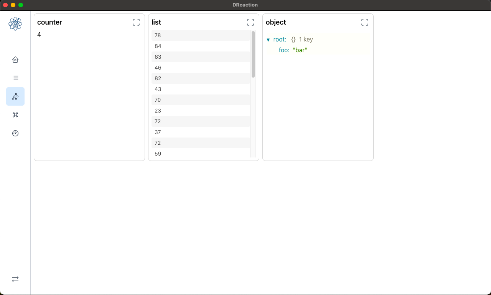
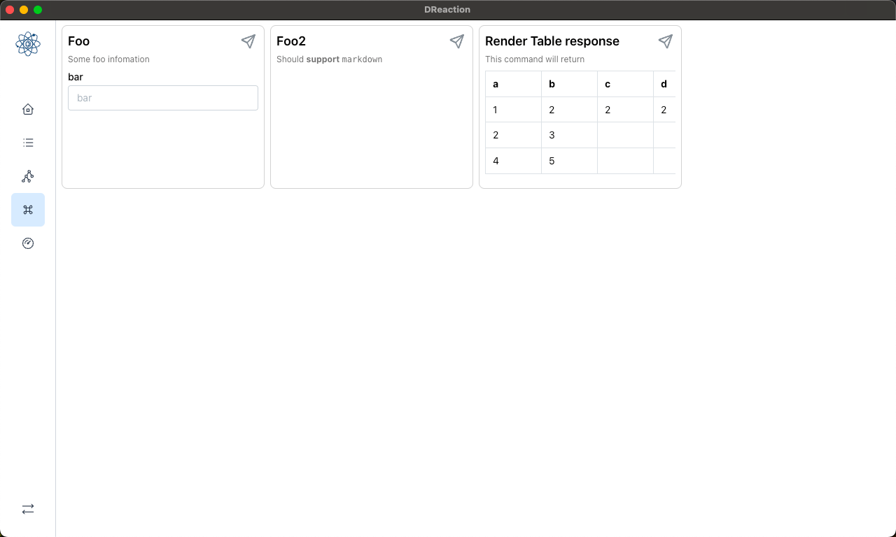
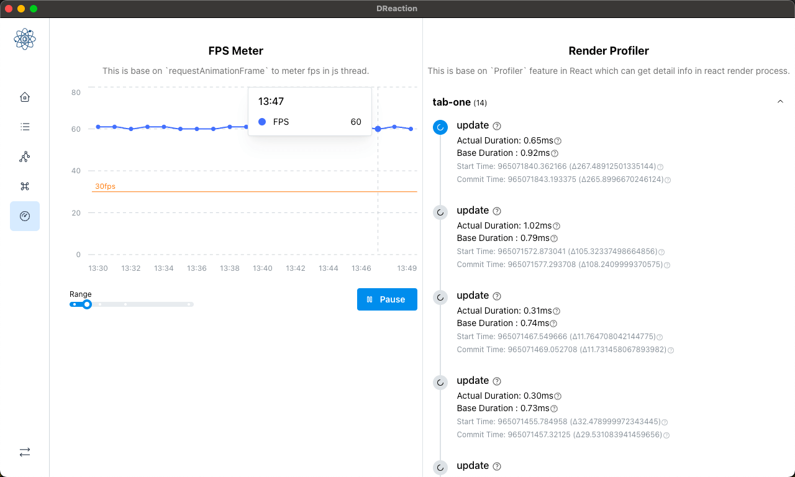

# DReaction

Your best debug tool for `React Native`, `React/Web`, and `Native Android`

**Highlight**:

- 🟠 Debug Ball (Suuuuuper useful for QA!) 👀
- 📜 Logs/Network (Easily track logs and network requests) 🌐
- 🔍 Data Watcher (Keep an eye on your data in real-time) 📊
- ⚡ Custom Command (Run your own custom commands to make debugging even smoother) 🖥️
- 📈 Performance Monitor (Monitor your app’s performance and optimize like a pro) 💪

## Screenshot



#### Draggable ball

This is a draggable ball, you can drag it to anywhere you want. useful for your application is running in a non-developer's phone.



#### Summary

This is a summary of current connections.



#### Logs and Network


#### Data Watcher


#### Custom Command


#### Performance Monitor



## Get start

### Install Client in your Desktop

Download binary client in release page.

[https://github.com/moonrailgun/dreaction/releases](https://github.com/moonrailgun/dreaction/releases)

### Install package for React Native

```bash
npm install dreaction-react-native
```

Auto connect in dev

```typescript
import { dreaction } from 'dreaction-react-native';

if(__DEV__) {
  dreaction
    .configure()
    .setAsyncStorageHandler(AsyncStorage)
    .useReactNative()
    .connect();
}
```

or use a ball which can custom ip in mobile, its very helpful for your application is running in a non-developer's phone.

```tsx
import { DReactionDraggableBall } from 'dreaction-react-native';

function AppContainer() {
  return (
    <>
      <App />
      <DReactionDraggableBall />
    </>
  );
}
```

### Install SDK for Native Android

Add JitPack repository and dependency:

```gradle
// settings.gradle.kts or root build.gradle
repositories {
    maven { url 'https://jitpack.io' }
}

// app/build.gradle
dependencies {
    debugImplementation 'com.github.moonrailgun:dreaction:android-1.0.0'
}
```

Initialize in your Application class:

```kotlin
import com.moonrailgun.dreaction.DReaction
import com.moonrailgun.dreaction.DReactionConfig

class MyApplication : Application() {
    override fun onCreate() {
        super.onCreate()
        
        if (BuildConfig.DEBUG) {
            DReaction.configure(
                DReactionConfig(
                    host = "192.168.1.100", // Your dev machine IP
                    port = 9600,
                    name = "My Android App"
                )
            )
            .useLogger()
            .useNetwork()
            .usePerformance(this)
            .useCustomCommand()
            .useSharedPreferences(this)
            .connect()
            
            DReaction.performance?.startMonitoring()
        }
    }
}
```

See [Android SDK Documentation](./sdk/android/README.md) for more details.

## Example

Check here to learn how to use those feature in code

[https://github.com/moonrailgun/dreaction/blob/master/example/expo-app/utils/dreaction.ts](https://github.com/moonrailgun/dreaction/blob/master/example/expo-app/utils/dreaction.ts) 


## Special Thanks

This Project is quick start from [reactotron](https://github.com/infinitered/reactotron), most protocol is same. thanks for provide so easy to use tools. This project just add more easy to use feature and improve UI.

## License

This project is licensed under the MIT License.
